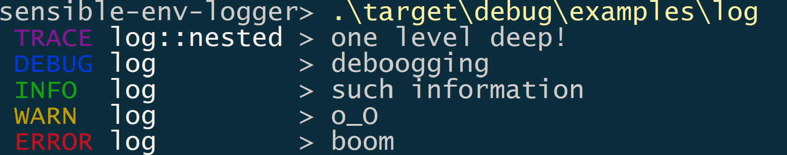

# sensible-env-logger

[](https://github.com/rnag/sensible-env-logger)
[](https://crates.io/crates/sensible-env-logger)
[](https://docs.rs/sensible-env-logger)
[](https://github.com/rnag/sensible-env-logger/actions?query=branch%3Amain)

> A pretty, sensible logger for Rust - ideal for running *examples* and *tests* on a crate of choice.

This is a thin wrapper around [pretty_env_logger]. It requires minimal configuration to set up, and writes
to standard error with nice colored output for log levels.



[pretty_env_logger]: https://docs.rs/pretty_env_logger

---

This crate works with Cargo with a `Cargo.toml` like:

```toml
[dependencies]
log = "0.4"
sensible-env-logger = "0.1"
```

## Getting started

The `sensible-env-logger` is ideally used when writing out [examples] 
or [tests] for a Cargo project or crate. It can be added as a
[`dev-dependency`] if needed.

[examples]: http://xion.io/post/code/rust-examples.html
[tests]: https://doc.rust-lang.org/book/ch11-01-writing-tests.html
[`dev-dependency`]: https://doc.rust-lang.org/rust-by-example/testing/dev_dependencies.html

First, add some usage to your application:

```rust
#[macro_use] extern crate log;

fn main() {
    sensible_env_logger::init!();

    info!("such information");
    warn!("o_O");
    error!("much error");
}
```

Then run your app with `cargo`, and you should see the full log output:

```console
cargo run
```

Alternatively, run your app with the environment variables that control the log level
for *external* crates as well as *your* crate explicitly set:

```console
GLOBAL_RUST_LOG=warn RUST_LOG=trace cargo run
```

Even though this crate has the name *env* in it, using the `sensible-env-logger`
in code is dead simple, and requires minimal configuration.

## Examples

You can check out sample usage of this crate in the [examples/](https://github.com/rnag/sensible-env-logger/tree/main/examples)
folder in the project repo on GitHub.

## Defaults

The helper macros below can be used to configure the global logger
with *sensible* defaults. Their sample log output is also shown.

> Note: any helper macros, such as `init!()`, should be called
> early in the execution of a Rust program.

### `init!()`

Initializes the global logger with a pretty, sensible env logger.

```console
INFO  my_module         > an informational message
```

### `init_timed!()`

Initializes the global logger with a *timed* pretty, sensible env logger.

```console
2022-03-12T17:15:31.683Z INFO  my_module         > an informational message
```

### `init_timed_short!()`

Initializes the global logger with a *localized time* pretty, sensible env logger.

```console
12:15:31.683 INFO  my_module         > an informational message
```

Using `init_timed_short!()` requires the `local-time` feature to be enabled:

```toml
[dev-dependencies]
sensible-env-logger = { version = "0.1", features = ["local-time"] }
```

## In Tests

When running *tests* on a crate, you can use the `safe_init!()` macro
as shown below. This should ignore errors when initializing the global
logger multiple times.

```rust
#[cfg(test)]
mod tests {
    use super::*;

    #[test]
    fn test_one() {
        sensible_env_logger::safe_init!();
        trace!("hello from the first test")
    }

    #[test]
    fn test_two() {
        sensible_env_logger::safe_init!();
        trace!("hello from the second test")
    }
}
```

## Rationale

Imagine you are testing out a Cargo project named `my_rust_project`. That is,
the `Cargo.toml` in your project would look something like this:

```toml,no_sync
[package]
name = "my-rust-project"

[dependencies]
log = "*"
```

Assuming you are building a library, your `src/lib.rs` could look like this:

```rust
#[macro_use] extern crate log;

pub fn my_awesome_fn() {
    trace!("getting ready to do something cool...");
    std::thread::sleep(std::time::Duration::from_millis(500));
    info!("finished!");
}
```

You then create a new [example] file named `examples/my_example.rs`, with the following
contents:

```rust
use my_rust_project::my_awesome_fn;
#[macro_use] extern crate log;

fn main() {
    debug!("my debug message");
    my_awesome_fn();
    error!("oops! something went wrong!");
}
```

[example]: http://xion.io/post/code/rust-examples.html

You can run the new file with `cargo run --example my_example`. The problem here is that you won't
get any terminal output by default; this is because you need to set up the `RUST_LOG`
environment variable beforehand, in order to see the expected log output.

Setting the `RUST_LOG` variable works, but there are a few issues with this. For example, what if your Cargo project uses other external libraries? Ideally you want to
see the `trace` logs from your own project (the crate under test), but *not* the
`trace` logs from these other libraries. In that case, setting `RUST_LOG=trace`
doesn't seem the best approach here.

You could then set the `RUST_LOG` environment variable to the following [log format]:

```shell
$ export RUST_LOG='warning,my_rust_project=trace,my_example=trace'
```

When leveraging the [pretty_env_logger] crate and adding a `pretty_env_logger::init()`
at the top of the `main` function, this does now work as expected and produce the desired log output.

However, there are few limitations with this approach:

* In your Cargo project, you'd need to update the documentation for running examples to
  mention that you need to export the `RUST_LOG` env variable explicitly. For instance,
  you'd need to mention that an example is ideally run like `RUST_LOG=trace cargo run --example my_example`.

* You'd need to remember to set the `RUST_LOG` env variable each time. This can be troublesome
  when your Windows machine reboots for example, or whenever you open a new terminal window.

To solve these minor issues you can simply use the `sensible_env_logger` crate, which
automatically sets up *sensible* defaults; this involves generating and using a
directive string in the same form as the `$RUST_LOG` environment variable.

Now, the updated code in the `examples/my_example.rs` would look like this:

```rust
use my_rust_project::my_awesome_fn;
#[macro_use] extern crate log;

fn main() {
    sensible_env_logger::init!();

    debug!("my debug message");
    my_awesome_fn();
    error!("oops! something went wrong!");
}
```

[log format]: https://rust-lang-nursery.github.io/rust-cookbook/development_tools/debugging/config_log.html

## Contributing

Contributions are welcome! Open a pull request to fix a bug, or [open an issue][]
to discuss a new feature or change.

Check out the [Contributing][] section in the docs for more info.

[Contributing]: CONTRIBUTING.md
[open an issue]: https://github.com/rnag/sensible-env-logger/issues

## License

This project is proudly licensed under the MIT license ([LICENSE](LICENSE)
or http://opensource.org/licenses/MIT).

`sensible-env-logger` can be distributed according to the MIT license. Contributions
will be accepted under the same license.

## Authors

* [Ritvik Nag](https://github.com/rnag)
