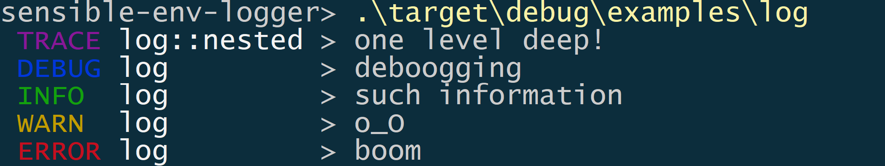

# sensible-env-logger

[](https://github.com/rnag/sensible-env-logger)
[](https://crates.io/crates/sensible-env-logger)
[](https://docs.rs/sensible-env-logger)
[](https://github.com/rnag/sensible-env-logger/actions?query=branch%3Amain)

> A pretty, sensible logger for Rust - ideal for running *examples* and *tests* on a crate of choice.

This is a thin wrapper around [pretty_env_logger]. It requires minimal configuration to set up, and writes
to standard error with nice colored output for log levels.



[pretty_env_logger]: https://docs.rs/pretty_env_logger

---

This crate works with Cargo with a `Cargo.toml` like:

```toml
[dependencies]
log = "0.4"
sensible-env-logger = "0.0.1"
```

## Getting started

The `sensible-env-logger` is ideally used when writing out [examples] 
or [tests] for a Cargo project or crate. It can be added as a
[`dev-dependency`] if needed.

[examples]: http://xion.io/post/code/rust-examples.html
[tests]: https://doc.rust-lang.org/book/ch11-01-writing-tests.html
[`dev-dependency`]: https://doc.rust-lang.org/rust-by-example/testing/dev_dependencies.html

First, add some usage to your application:

```rust
#[macro_use] extern crate log;

fn main() {
    sensible_env_logger::init();

    info!("such information");
    warn!("o_O");
    error!("much error");
}
```

Then, run your app with `cargo`:

```console
cargo run
```


Even though this crate has the name *env* in it, using the `sensible-env-logger`
in code is dead simple, and requires minimal configuration.

## Examples

You can check out sample usage of this crate in the [examples/](https://github.com/rnag/sensible-env-logger/tree/main/examples)
folder in the project repo on GitHub.

## Rationale

Imagine you are testing out a Cargo project named `my_rust_project`. That is,
the `Cargo.toml` in your project would look something like this:

```toml,no_sync
[package]
name = "sensible-env-logger"
```

You then create a new [example] file named `examples/my_example.rs`, with the following
contents:

```rust
use my_rust_project::my_awesome_fn;
#[macro_use] extern crate log;

fn main() {
    debug!("my debug message");
    my_awesome_fn();
    error!("oops! something wrong!");
}
```

[example]: http://xion.io/post/code/rust-examples.html

You can run the new file with `cargo run --example my_example`. But the problem is, you won't
get any terminal output by default. This is because you initially need to set up the `RUST_LOG`
environment variable beforehand, in order to see the expected log output.

There are few issues that might arise. For example, what if your Cargo project uses other external libraries? Ideally you want to
see the `trace` logs from your own project (the crate under test), but *not* the
`trace` logs from these other libraries. In that case, setting `RUST_LOG=trace`
doesn't seem the best approach here.

You could then set the `RUST_LOG` environment variable to the following [log format]:

```shell
$ export RUST_LOG='warning,my_rust_project=trace,my_example=trace'
```

When leveraging the [`pretty-env-logger`] crate and adding a `pretty_env_logger::init()`
at the top of the `main` function, this does now work as expected and produce the desired log output.

However, there are a few issues with this approach:

* What if you are testing out another example which uses the `log` module? For example,
 an `examples/my_other_example.rs`. This means that you'd again have to update the `RUST_LOG`
 environment variable with the name of the example being run.

* If you are writing a library or a binary, you'd need to update the documentation for running
  examples to mention that you need to export the `RUST_LOG` env variable explicitly.
  For example, you'd need to mention that the example is ideally run like `RUST_LOG=trace cargo run --example my_example`.

* You'd need to remember to set the `RUST_LOG` env variable each time. This can be troublesome
  when your Windows machine reboots for example, or whenever you open a new terminal window.

To solve these issues, you can simply use the `sensible_env_logger` crate, which
automatically sets up the `RUST_LOG` environment variable with sensible defaults.

Now, the updated code in the `examples/my_example.rs` would look like this:

```rust
use my_rust_project::my_awesome_fn;
#[macro_use] extern crate log;

fn main() {
    sensible_env_logger::init();

    debug!("my debug message");
    my_awesome_fn();
    error!("oops! something wrong!");
}
```

[log format]: https://rust-lang-nursery.github.io/rust-cookbook/development_tools/debugging/config_log.html

## Defaults

> Note: any default helper functions, such as `init()`, should be called
> early in the execution of a Rust program.

### `init()`

Initializes the global logger with a pretty, sensible env logger.

Sample output:
```console
INFO  my_module         > an informational message
```

### `init_timed()`

Initializes the global logger with a *timed* pretty, sensible env logger.

Sample output:
```console
2022-03-12T17:15:31.683Z INFO  my_module         > an informational message
```

### `init_timed_short()`

Initializes the global logger with a *localized time* pretty, sensible env logger.

Sample output:
```console
12:15:31.683 INFO  my_module         > an informational message
```

Using `init_timed_short()` requires the `local-time` feature to be enabled:

```toml
[dependencies]
sensible-env-logger = { version = "0.0.1", features = ["local-time"] }
```

## Contributing

Contributions are welcome! Open a pull request to fix a bug, or [open an issue][]
to discuss a new feature or change.

Check out the [Contributing][] section in the docs for more info.

[Contributing]: CONTRIBUTING.md
[open an issue]: https://github.com/rnag/sensible-env-logger/issues

## License

This project is proudly licensed under the MIT license ([LICENSE](LICENSE)
or http://opensource.org/licenses/MIT).

`sensible-env-logger` can be distributed according to the MIT license. Contributions
will be accepted under the same license.

## Authors

* [Ritvik Nag](https://github.com/rnag)
